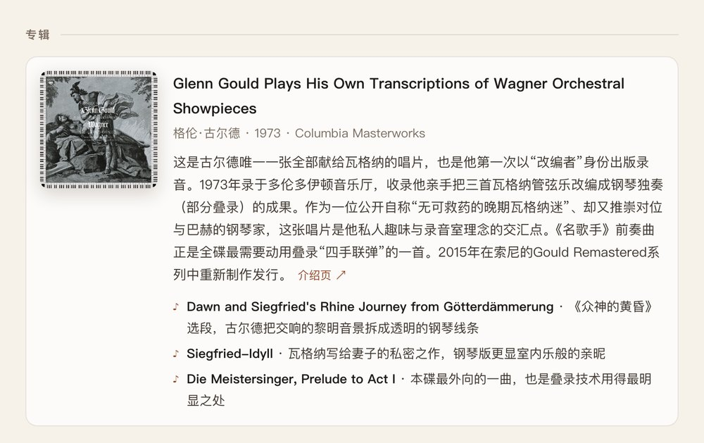
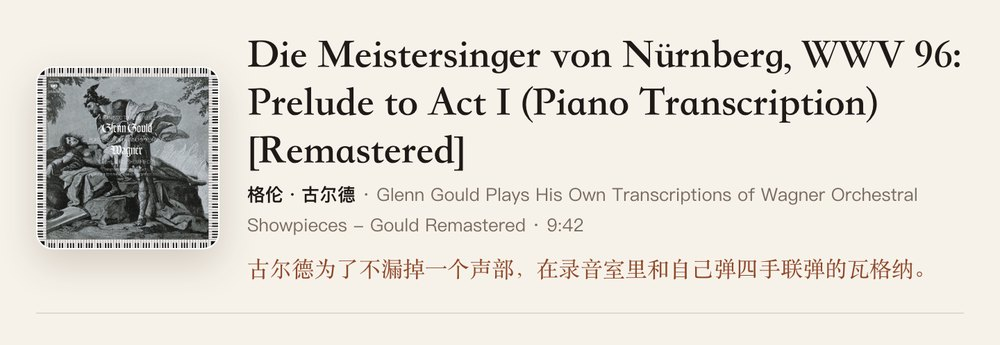
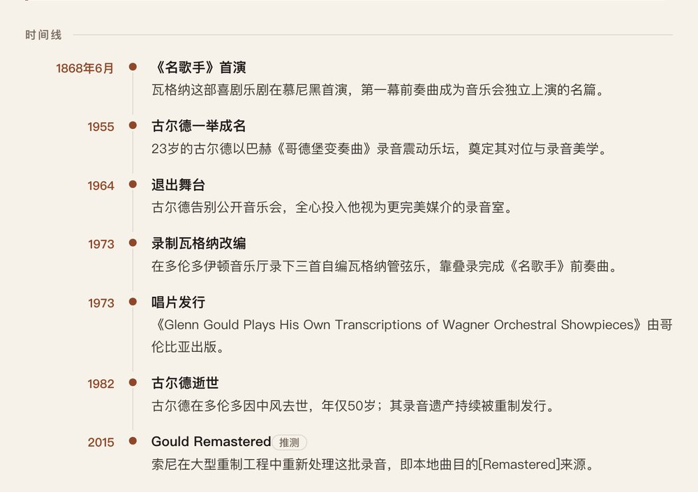
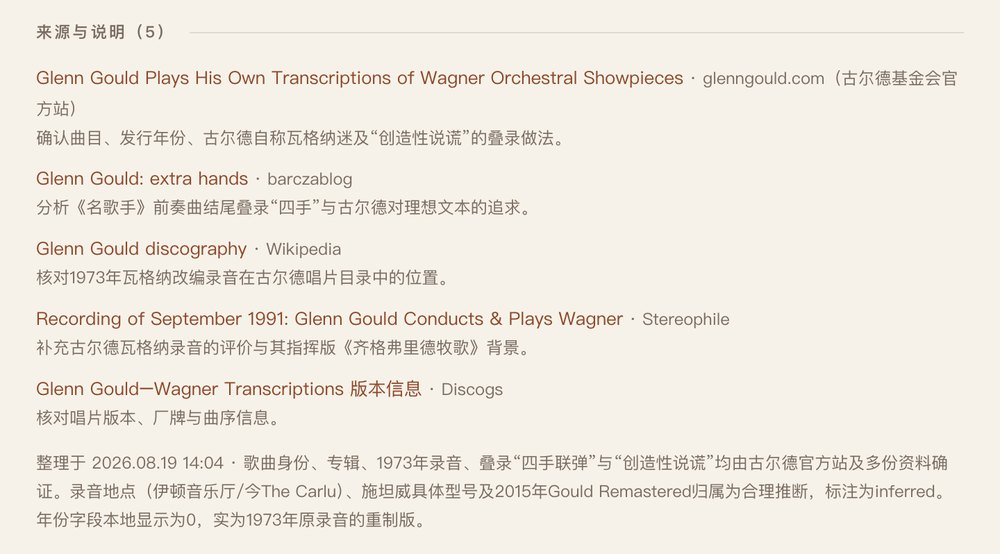

# 听歌档案 Music Dossier

**中文** · [English](README.en.md)

> 给 Apple Music 配一个乐评人。你放什么歌，它就在旁边写一份档案：**编辑手记、听点、专辑、人物、图集、轶事、时间线、延伸聆听、来源**——带图，有出处，两分钟出稿，再放秒开。

    

<p align="center">
  
  <br><sub>换一首歌，小窗跟着换：古尔德 → Nirvana 不插电 → Public Service Broadcasting → 巴赫 · The dossier follows whatever Music is playing</sub>
</p>

<table align="center">
  <tr>
    <td align="center" valign="top"><br><sub>编辑手记：三段、五百来字、有细节有观点 · Editor's notes</sub></td>
    <td align="center" valign="top"><br><sub>图集：来自维基百科的人物 / 原作 / 场地 / 乐器 · Gallery from Wikipedia</sub></td>
  </tr>
  <tr>
    <td align="center" valign="top"><br><sub>人物：头像 + 小传 + 维基百科链接 · People with portraits</sub></td>
    <td align="center" valign="top"><br><sub>专辑：介绍 + 同碟推荐 · Album card</sub></td>
  </tr>
</table>

<details>
<summary>📷 更多截图 · More screenshots（顶部 / 听点 / 轶事 / 时间线 / 延伸聆听 / 来源 / 顶栏 / 夜间模式）</summary>
<p align="center">
  <br><sub>顶部：封面 · 曲名 · 艺人 · 专辑 · 时长 · 一句引子</sub><br><br>
  <br><sub>听点：告诉你耳朵该往哪儿放</sub><br><br>
  <br><sub>轶事：有来源的好玩事</sub><br><br>
  <br><sub>时间线</sub><br><br>
  <br><sub>延伸聆听：封面自动配好</sub><br><br>
  <br><sub>来源：平时收着，点开看，每条注明支撑了哪句话</sub><br><br>
  <br><sub>顶栏：夜间 · 固定 · 刷新 · 来源</sub><br><br>
  <br><sub>同一页，日夜两版</sub>
</p>
</details>

**English**: A macOS-only floating panel that follows Apple Music. Whenever a new track plays, it hands the title / artist / album to **Claude** (via your local Claude Code CLI), lets it research the web for ~2 minutes, and renders a dossier in your language: editor's notes, listening notes, album card, people with Wikipedia portraits and bios, an image gallery, key facts, anecdotes, timeline, related listening with cover art, and cited sources. Everything is cached locally — the second time a song plays, the page opens instantly. No server, no account: your Mac, your Claude login, your data. **Requires macOS 14+ and a logged-in Claude Code CLI.** Dossiers and UI come in **11 languages** (English, 简体中文, 繁體中文, 日本語, 한국어, Español, Français, Deutsch, Português, Русский, Italiano) — it follows your system language, or set `"language"` in the config. Full English README: [README.en.md](README.en.md).

---

## ⚠️ 开始前请确认（必读）

| 条件 | 要求 | 说明 |
|---|---|---|
| 操作系统 | **macOS 14 (Sonoma) 及以上** | Apple Silicon 与 Intel 都行（从源码编译） |
| 机型 | 一键安装需 **Apple Silicon（M 系列）**| Intel Mac 走源码安装（需 Command Line Tools） |
| 播放器 | **Apple Music（Music.app）** | 本地曲库或流媒体都可以；Spotify 等暂不支持 |
| 写作引擎 | **二选一**：① 国产大模型 API Key（DeepSeek / 通义千问 / Kimi / 智谱，推荐小白）② 本机已登录的 Claude Code CLI | ① 在应用「设置」里粘贴 Key 即可，约 20 秒出稿，一首几分钱；② 联网深度研究，约 2 分钟、$0.2–0.5 一首 |
| 网络 | 能访问 Anthropic、Wikipedia、iTunes | 图片来自 Wikimedia Commons 与 iTunes Search API |

**隐私**：没有服务器、不用注册；档案与图片都存在 `~/Library/Application Support/MusicDossier/`；发出去的只有曲名 / 艺人 / 专辑 / 时长这几个字。

## 一、这是什么

听歌的时候你想知道的那些事——这首歌是怎么写出来的、录音时发生了什么、这个人是谁、为什么今天还值得听——以前得自己去搜。**听歌档案**把这一步省掉：它盯着 Music 在放什么，替你先读几篇资料，写一份有编辑立场的档案摆在旁边。

一份档案从上到下：

| 板块 | 内容 |
|---|---|
| **顶部** | 封面 · 曲名 · 艺人 · 专辑 · 时长 · 一句 30 字以内的引子 |
| **编辑手记** | 3 段、350–600 字：谁在什么处境下写的、录音时的关键选择、发行后发生了什么、为什么今天仍值得听 |
| **听点** | 2–4 条，指向具体能听到的东西（某段前奏、某个乐器、某处结构转折） |
| **专辑** | 封面 · 年份 · 厂牌 · 3–5 句介绍 · 同碟 2–5 首推荐 |
| **人物** | 2–4 位关键人物：维基百科头像 · 100–180 字小传 · 词条链接 |
| **图集** | 3–6 张：人物 / 原作 / 首演地 / 录音室 / 乐器 / 相关作品，每张一句说明与出处 |
| **要点** | 硬信息卡：榜单、采样、影视使用、版本差异、录音技术细节 |
| **轶事** | 2–4 条有来源的好玩事 |
| **时间线** | 4–7 个节点 |
| **延伸聆听** | 4–6 首，说明和这首歌的关系，自动配封面 |
| **来源** | ≥4 条可打开的 URL，注明各自支撑了什么；默认折叠 |

查实与推断分开标：没把握的条目会带一个小小的「推测」标签。

## 二、安装

### 方式 A：一行命令（推荐，小白友好）

打开「终端」（启动台搜 Terminal），把下面整行粘贴进去，回车：

```bash
curl -fsSL https://raw.githubusercontent.com/waytosea-oss/music-dossier/main/install.sh | bash
```

脚本会自动下载最新版、装进「应用程序」并打开。**不需要装任何开发工具。**（仅支持 Apple Silicon 的 Mac）

装好后应用会弹出「设置」窗：

1. 服务商选 **DeepSeek**（最便宜）或通义千问 / Kimi / 智谱；
2. 点「还没有 Key？」链接去注册，复制 API Key 粘贴回来；
3. 点「测试连接」看到绿色的"连接成功"，点「保存」。

然后打开 Apple Music 放一首歌，小窗就开始写档案了。

### 方式 B：源码安装（开发者 / Intel Mac / 想用 Claude 引擎）

```bash
git clone https://github.com/waytosea-oss/music-dossier.git
cd music-dossier
Scripts/install.sh --launcher --autolaunch
```

1. 脚本会检查 `swift`，编译并打包到 `/Applications/Music Dossier.app`；
2. `--launcher`（可省）：桌面放一个「启动 Music Dossier」图标；
3. `--autolaunch`（可省）：打开 Music 时自动出现小窗，每个 Music 会话只弹一次，手动关掉不会反复弹。卸载：`Scripts/install_autolaunch.sh --remove`。

本机装有已登录的 Claude Code CLI 时会优先用它（研究更深）；否则同样在「设置」里填国产模型的 Key。

### 方式 C：订阅制（不想按量充值的看这里）

国产模型里有两家提供**包月订阅**、且开放了 Anthropic 兼容接口——配合 Claude Code CLI，就能像 Claude 订阅一样"包月直通"本应用：

| 订阅 | 大概价位 | 接口地址 |
|---|---|---|
| [智谱 GLM Coding Plan](https://open.bigmodel.cn) | 入门档约 ¥20/月 | `https://open.bigmodel.cn/api/anthropic` |
| [Kimi 编码订阅](https://platform.moonshot.cn) | 以官网为准 | `https://api.moonshot.cn/anthropic` |

配置三步（以智谱为例）：

1. 安装 Claude Code CLI：`npm install -g @anthropic-ai/claude-code`（需要先装 [Node.js](https://nodejs.org/zh-cn)）；
2. 订阅 Coding Plan 后拿到 Key，写进 `~/.claude/settings.json`（没有就新建）：

```json
{
  "env": {
    "ANTHROPIC_BASE_URL": "https://open.bigmodel.cn/api/anthropic",
    "ANTHROPIC_AUTH_TOKEN": "你的智谱Key"
  }
}
```

3. 重新打开 Music Dossier——它检测到本机有 `claude` 就会走这条通道，订阅额度内随便用。

> 写进 `settings.json` 而不是 shell 环境变量，是因为从 Finder 双击启动的应用读不到你终端里的环境变量。若提示模型不存在，把配置里的 `claudeModel` 改成服务商的模型名（如 `glm-4.6`）。有 Claude 官方订阅的忽略本节：`claude` → `/login` 即可。

## 三、首次启动必读

**1. 「是否允许控制 Music」**：首次启动 macOS 会弹自动化权限，点**允许**。这是它读取当前曲目与封面的唯一通道。误点了拒绝：系统设置 → 隐私与安全性 → 自动化 → Music Dossier → 勾上 Music。

**2. Gatekeeper**：本 App 本地临时签名、未公证。若提示"无法打开"：系统设置 → 隐私与安全性 → 「仍要打开」；或 `xattr -dr com.apple.quarantine "/Applications/Music Dossier.app"`。

**3. 写作引擎**：没配引擎时应用会自动弹「设置」窗（菜单栏 ⌘, 也能打开）：选服务商 → 贴 Key → 测试 → 保存，全程不用碰配置文件。用 Claude Code 的：终端里 `claude` → `/login` 登录一次即可，应用会自动检测。

**4. 想改名**（比如叫 "Tilo's Music Dossier"）：在 `Scripts/local.env` 写两行再重新 `Scripts/install.sh`：

```bash
MUSIC_DOSSIER_APP_NAME="Tilo's Music Dossier"
MUSIC_DOSSIER_BUNDLE_ID="com.yourname.musicdossier"
```

## 四、用法

- **11 种语言**：档案正文和界面都跟随系统语言（简体/繁体中文、英、日、韩、西、法、德、葡、俄、意）；也可在配置里用 `"language"` 固定，比如 `"en"`、`"ja"`。
- **自动跟歌**：Music 换一首，小窗换一份；换得太快时旧的研究会被取消，不白花钱。
- **夜间 / 日间**：深浅两套配色，记住你的选择。
- **固定**：按住当前这首不放，Music 跳到下一首也不冲掉；再点「取消固定」继续跟。
- **刷新**：扔掉旧档案重写一份。
- **来源**：把这份档案引用的网页在浏览器里一次打开。
- **缓存**：查过的歌本地秒开；总量超过上限（默认 300MB）自动清最旧的。
- **Obsidian 镜像**（可选）：每首歌另存一份 Markdown（含图）到你的笔记库，顺手攒一本听歌笔记。

## 五、配置

`~/Library/Application Support/MusicDossier/config.json`（安装时从 [`config.example.json`](config.example.json) 复制）：

| 键 | 默认 | 说明 |
|---|---|---|
| `language` | `auto` | 档案与界面语言：`auto`（跟随系统）/ `en` / `zh-Hans` / `zh-Hant` / `ja` / `ko` / `es` / `fr` / `de` / `pt` / `ru` / `it` |
| `researchProvider` | `auto` | `auto`（Claude CLI > 国产 API > OpenAI > Codex）/ `claude-cli` / `api` / `openai-responses` / `codex-cli` |
| `claudeModel` | `claude-opus-4-8` | 传给 `claude --model` |
| `claudeEffort` | `medium` | `low` 更省，`high` 更细 |
| `cacheMaxAgeDays` | 30 | 档案多久算过期 |
| `cacheMaxTotalMB` | 300 | 图片 + 页面缓存总量上限，超过按最旧滚动删除 |
| `pollIntervalSeconds` | 1.5 | 多久问一次 Music 在放什么 |
| `enableObsidianMirror` / `obsidianVaultPath` / `obsidianExportRelativePath` | 关 | 打开并填库路径后，每首歌写一份 Markdown 到 `<库>/20_Music Dossier/` |
| `enableFavoritesPrewarm` / `favoritesPrewarmLimit` | 关 | 启动后在后台预研究收藏曲目（会花钱，默认关） |
| `apiProvider` / `apiKey` / `apiModel` / `apiBaseURL` | 空 | 国产/通用模型引擎（`deepseek` / `qwen` / `kimi` / `glm` / `custom`）。**推荐用应用内「设置」窗填，不必手改** |
| `openAIAPIKey` / `openAIModel` / `openAIBaseURL` | 空 | OpenAI Responses 备选引擎 |

同名环境变量可覆盖（`MUSIC_DOSSIER_CLAUDE_MODEL`、`MUSIC_DOSSIER_CACHE_MAX_MB`、`MUSIC_DOSSIER_OBSIDIAN_VAULT` …）。

## 六、它是怎么做到的

1. **听**：每 1.5 秒通过 AppleScript 问 Music 当前曲目，拿到曲名、艺人、专辑、时长、封面（流媒体拿不到封面时去 iTunes 补一张）。
2. **查**：调用本机 `claude -p`，附上一段话——"你是一位资深音乐编辑，用〈目标语言〉写作……先联网核实这是哪个版本，再查创作背景、人物、录音细节、乐评、轶事，至少搜四轮，搜不到就少写、不许编"——并用 JSON Schema 约束输出结构（`--json-schema`）。网络抖动自动重试两次。
3. **配图**：模型只负责判断"该配哪个维基百科词条"，程序拿词条名去 Wikipedia REST API 取首图和来源页；专辑与延伸聆听的封面走 iTunes Search API。落盘前一律缩到 ≤1200px。谁擅长什么，就让谁干什么。
4. **存**：SQLite 存档案 JSON，图片按歌缓存；展示旧档案时会补抓缺的图并回写；启动时清孤儿文件与超限缓存。

## 七、常见问题

**Q: 一直显示"正在整理本地元数据"？**
A: 先看 `~/Library/Application Support/MusicDossier/workspace/last-run.log`，里面有上一次调用 `claude` 的退出码与输出。多半是没登录（见上文）或网络不通。

**Q: 生成很慢 / 想省钱？**
A: `claudeEffort` 改 `low`，或 `claudeModel` 换更便宜的模型。质量会有差别。

**Q: 图集是空的？**
A: 图来自维基百科词条首图，词条没有图就取不到；程序会保留条目，下次展示时再试一次。

**Q: 想要英文 / 其他语言的档案？**
A: 默认跟随系统语言；在 `config.json` 里写 `"language": "en"`（或 `ja` / `ko` / `es` / `fr` / `de` / `pt` / `ru` / `it` / `zh-Hant`）后重启即可，界面和档案一起切换。已缓存的歌仍是生成时的语言，点「刷新」重写。想加新语言：在 [`Localization.swift`](Sources/MusicDossierKit/Localization.swift) 补一列文案 + 语言名即可，PR 欢迎。

**Q: 卸载怎么卸？**
A: `Scripts/install_autolaunch.sh --remove`；删除 `/Applications/Music Dossier.app`、桌面启动器、`~/Library/Application Support/MusicDossier/`。

## 平台支持 / Platform support

| 平台 | 状态 |
|---|---|
| macOS 14+ (Apple Silicon / Intel) | ✅ 源码构建，一条命令 |
| Windows / Linux | ❌ 不支持 |
| Spotify / 其他播放器 | ❌ 暂不支持（欢迎 PR：只需实现一个"当前曲目"读取器，见 `MusicClient.swift`） |

*Why macOS-only: the panel is AppKit/WebKit and the "now playing" reader is AppleScript against Music.app. The research / rendering / caching layers (`MusicDossierKit`) are plain Swift and portable — a Spotify or MPRIS reader is the missing piece. PRs welcome.*

## 开发

```bash
swift build
swift run MusicDossierApp          # 直接跑（不打包）
swift run MusicDossierSmokeTests   # 冒烟测试
script/build_and_run.sh            # 停旧实例 → 打包 → 打开
```

```
Sources/MusicDossierKit/
  ClaudeCLIResearchClient.swift   Claude Code CLI 引擎（提示词、Schema、重试、last-run.log）
  DossierPipeline.swift           研究 → 配图 → 缓存 → 导出
  HTMLRenderer.swift              页面渲染（日 / 夜两套配色）
  Localization.swift              11 种语言的界面文案与语言解析
  WikipediaImageResolver.swift    维基百科词条首图
  ITunesArtworkLookup.swift       专辑封面
  ImageDownscaler.swift           落盘前缩图
  CacheStore.swift                SQLite + 文件缓存、清理
  ObsidianExporter.swift          可选：Markdown 镜像
  MusicClient.swift               AppleScript 读 Music
  OpenAIResearchClient.swift / CodexCLIResearchClient.swift   备选引擎
Sources/MusicDossierApp/          NSPanel + WKWebView 小窗与状态机
Scripts/                          install / package / launcher / autolaunch
```

## 致谢

- 提示词与页面结构由 [Tilo Liang](https://github.com/waytosea-oss) 设计，代码由 Claude 协作完成。
- 图片来自 [Wikipedia / Wikimedia Commons](https://commons.wikimedia.org) 与 [iTunes Search API](https://developer.apple.com/library/archive/documentation/AudioVideo/Conceptual/iTuneSearchAPI/)，版权归各自所有者。

MIT License · Copyright (c) 2026 Tilo Liang
